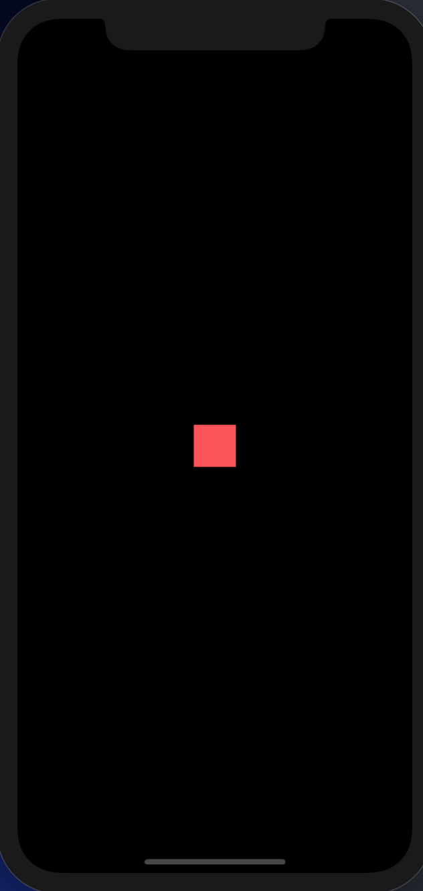

## 基础 Widgets

### Container 一个拥有绘制、定位、调整大小的 widget。

> Container作为最外层示例

注意:debug模式下的热更新可能会失效,停掉debug然后重新运行,请阅第三小段示例文字

```
import 'package:flutter/material.dart';
void main(List<String> args) {
  runApp(
    Container(height: 40.0, width: 40.0, color: Colors.redAccent)
  );
}
```


> Container 作为局部使用示例

注意:debug模式下的热更新可能会失效,停掉debug然后重新运行,请阅第三小段示例文字

```
import 'package:flutter/material.dart';
void main(List<String> args) {
  runApp(Center(
    child: Container(height: 40.0, width: 40.0, color: Colors.redAccent),
  ));
}
```



我在练习的过程中 出现 debug模式下 热更新 不起作用的现象，degbug 问题 呈现 test目录 widget_test.dart 文件 第三行 import 'package:lewis_flutter/main.dart'; 以及 main 函数中 await tester.pumpWidget(App()); 告警，这也可能是我练习的过程中 先使用的如下的方式 后来又使用了 如上所列示例中的方法导致的，后来我又改回到如下方式后热更新正常

```
import 'package:flutter/material.dart';
void main() => runApp(new App());

class App extends StatelessWidget {
  @override
    Widget build(BuildContext context) {
      
      return Center(
        child: Container(
          height: 40.0, 
          width: 40.0, 
          color: Colors.red[300], 
          margin: const EdgeInsets.all(20.0)
        ),
      );
    }
  
}
```